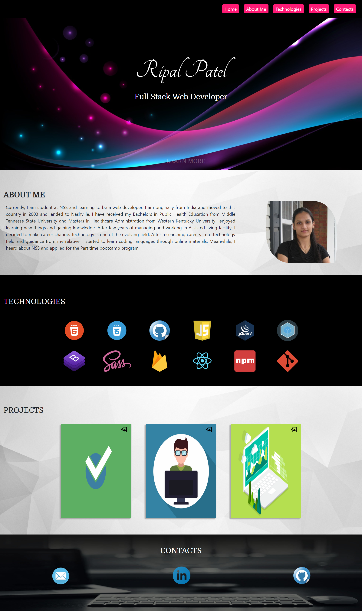

# Personal Biosite

## Description
This is responsive personal bio portfolio site. It gives all information that you need to know. :)

## Technologies Used
* Webpack
* Axios
* Firebase
* Bootstrap
* ES6 Modules
* SCSS

## Screenshots



## How to Run this Project
Note: A Firebase account is needed to run this app

1. Configure Firebase
* Clone the repository
* Do ```npm install``` in your terminal
* Rename apiKeys.json.example to apiKeys.json
* Create a new project in Firebase
* Copy the keys from Firebase into the apiKeys.json file
* Create a realtime database in Firebase
* Import projects.json into the Firebase to feed the data

2. Serve up the app
* Run ```npm start``` in your terminal to initiate the app.

## Live Demo
[Demo](https://personal-bio-site-38428.firebaseapp.com)